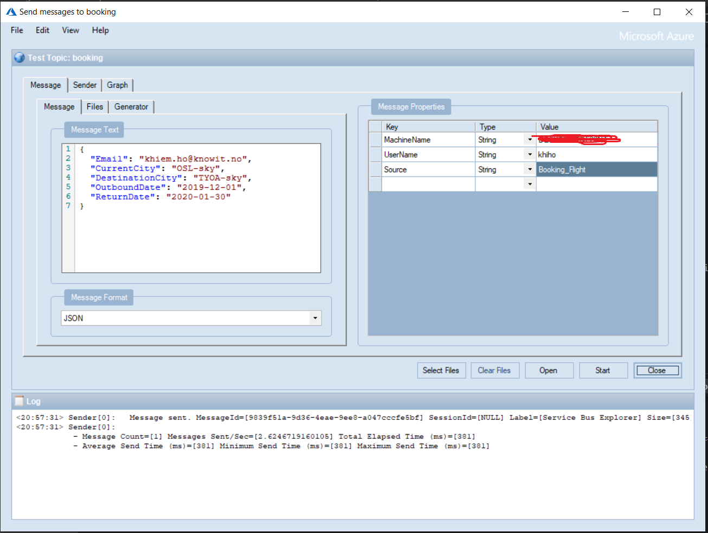

# Serverless Architecture - PoC for booking flights and hotels

## Azure DevOps Status
[](https://dev.azure.com/khiemho/PocSpace/_build/latest?definitionId=3&branchName=master)
## Requirements
## Add Build pipeline to your Azure DevOps
Use the azure-pipelines.yml and import it to a build pipeline.

## Add Release Pipeline to your Azure DevOps
// Deploy setup will come later. The following content will include:
- Azure Infrastructure setup - All ARM templates are in CI folder
- Deploy Functions to the specific Function Apps

## How to run locally
Add following to your local.settings.json:
```json
{
  "IsEncrypted": false,
  "Values": {
    "AzureWebJobsStorage": "UseDevelopmentStorage=true",
    "AzureWebJobsDashboard": "UseDevelopmentStorage=true",
    "FUNCTIONS_WORKER_RUNTIME": "dotnet",
	  "SkyScannerHostApi": "<Uri host>",
    "KeyVaultUri": "<KeyVault URI>",
    "ServicebusConnectionString": "<Storage URI>"
  },

  "Host": {
    "LocalHttpPort": 7071,
    "CORS": "*"
  }
 }
  ```

Use Azure Service Bus Explorer and set property to the following if you need to send to specific subscribers:
- Booking_Hotel
- Booking_Flight
- Booking_Combination

Example of how the the message should be set up:

<p align="center">

</p>


For each message, the following should contain per subscriber:

- Hotel
```
{
  "Email": "test@test.com",
  "DestinationCity": "Tokyo",
  "ArrivalDate": "2019-12-01",
  "DepartureDate": "2019-12-30",
  "GuestQty": 1,
  "RoomQty": 1,
  "TravelPurpose": "leisure"
}
```

- Flight
```
{
  "Email": "test@test.com",
  "CurrentCity": "OSL-sky",
  "DestinationCity": "TYOA-sky",
  "OutboundDate": "2019-12-01",
  "ReturnDate": "2019-12-30"
}
```
- Combination
```
{
  "Email": "test@test.com",
  "CurrentCityCode": "OSL-sky",
  "DestinationCode": "TYOA-sky",
  "DestinationCity": "Tokyo",
  "OutboundDate": "2019-12-01",
  "ReturnDate": "2019-12-30",
  "GuestQty": 1,
  "RoomQty": 1,
  "TravelPurpose": "leisure"
}
```

## Use case
Showing a proof of concept for suggestions for booking flights and hotel. This will include Azure Functions and Durable Functions as a concept to fetch relevant data by getting a message from service 
bus and call different apis.

When the functions are done, the relevant user will get an email for suggestions of the given city, date and price.
All content will be sent as an attachment in JSON format.


### Architecture approach
<p align="center">

</p>

## Powerpoint slides
Check in Documents folder for the file "Serverless-Architecture.pptx"